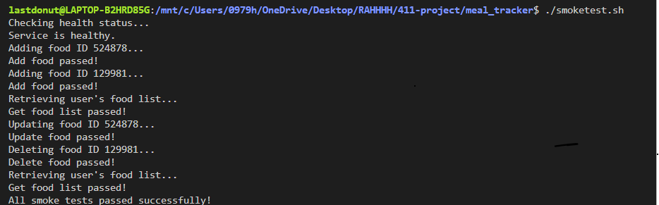

# 411-project    -    Meal-Tracker
Meal Tracker by
Harrison hche@bu.edu, 
Evan evanda@bu.edu,
Beren bydonmez@bu.edu

Notes for Grading: The berensnewbranch2 and meal-max copy was worked on initially. Then we met and decided to make a meal-tracker during our daily meetings instead of the workout model you are seeing if you look at the different branches. 

  Our app is a meal-tracking and nutrition management system in order to help people track their dietary intakes. It provides an easy and comprehensive way of doing this. Meal tracker makes use of the Wger API to fetch detailed nutritional information about different food ingredients, which lets users build a personalized database. Moreover, users can create accounts,  authenticate themselves, and then interact with our food management system where they can add, update, retrieve, and delete ingredients from their  food inventory. We aimed to make our app follow a modular approach so there are distinct components handling user authentication, food ingredient management, and database interactions. We implemented password hashing and storage in the user model, ensuring user credentials are protected. The food model on the other hand is a flexible interface for retrieving nutritional data, with functions that we implemented to  allow our users to fetch ingredient details by ID, store those ingredients locally, and perform  CRUD (Create, Read, Update, Delete) operations on their food list. A bash-based smoke test script further validates the application's functionality by systematically testing various API endpoints, including health checks, user account creation, login processes, and food ingredient management operations. Here is a screenshot of our smoketest working:

